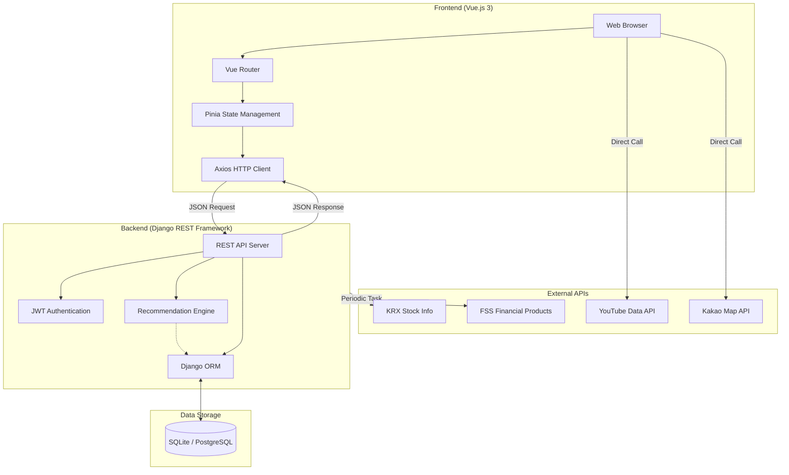
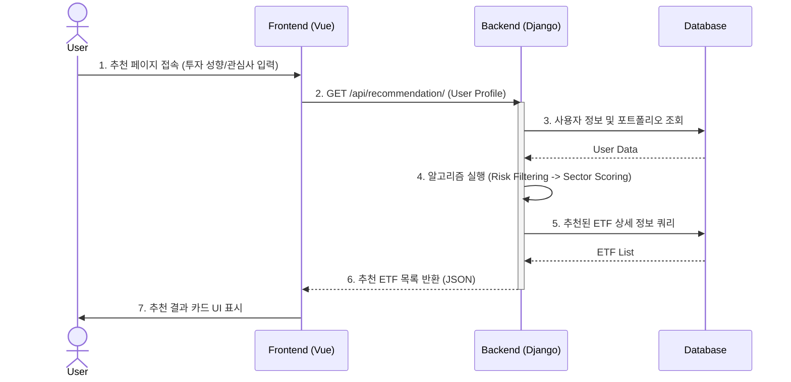
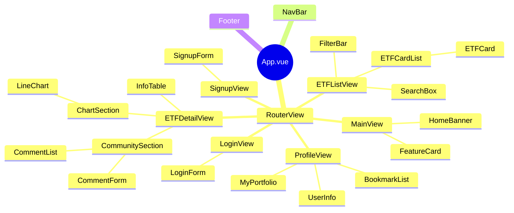
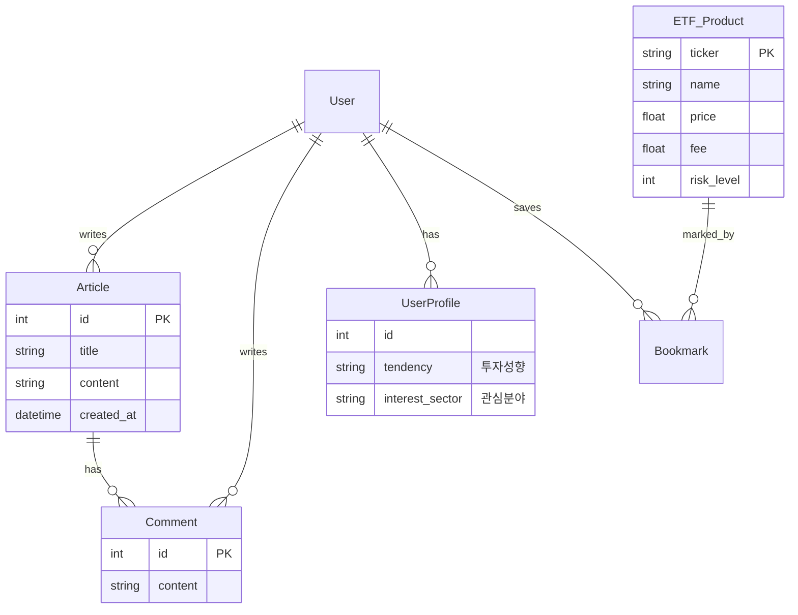
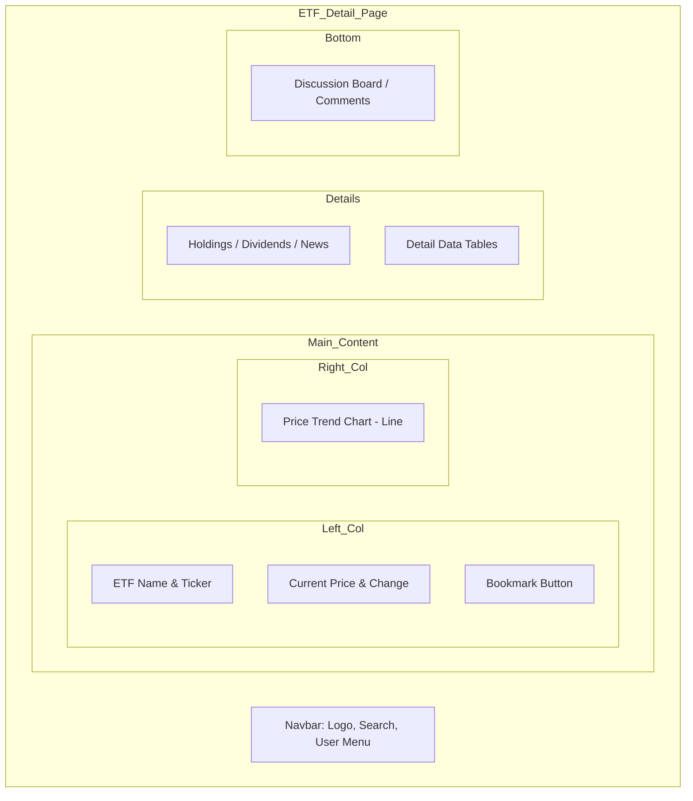

# 모으다 (MOUDA) - ETF 투자 플랫폼

## 1. 전체 서비스 아키텍쳐



- **Client Side:** Vue.js 3를 기반으로 하며, Pinia를 통해 상태 관리를 수행합니다. Axios를 사용하여 백엔드와 비동기 통신을 합니다.
- **Server Side:** Django REST Framework(DRF)를 사용하여 RESTful API를 제공합니다. JWT 방식을 통해 사용자 인증을 처리하며, Pandas를 활용한 데이터 분석 및 추천 알고리즘이 포함되어 있습니다.
- **Database:** 관계형 데이터베이스(SQLite 또는 PostgreSQL)를 사용하여 회원 정보, 금융 상품 데이터, 커뮤니티 게시글을 저장합니다.
- **External Interface:** KRX 및 금융감독원 API는 서버에서 주기적으로 데이터를 수집하여 DB에 적재하고, YouTube 및 Kakao Map API는 클라이언트에서 실시간으로 호출하여 사용자 경험을 향상시킵니다.

---

## 2. 시퀀스 다이어그램



- **요청:** 사용자가 추천 페이지에 진입하거나 '추천받기' 버튼을 클릭하면 프론트엔드는 사용자의 프로필 정보(투자 성향, 관심 키워드)를 포함하여 백엔드에 추천 요청을 보냅니다.
- **처리:** 백엔드는 먼저 사용자의 투자 성향(예: 공격형)을 파악하고, DB에서 해당 위험도 범위에 있는 ETF 상품들을 1차 필터링합니다. 그 후 사용자의 관심 섹터와 ETF의 종목 정보를 비교하여 점수를 매깁니다.
- **응답:** 점수가 가장 높은 상위 N개의 ETF 정보를 JSON 형태로 프론트엔드에 반환합니다.
- **렌더링:** 프론트엔드는 받은 데이터를 카드 형태의 UI로 변환하여 사용자에게 보여줍니다.

---

## 3. 컴포넌트 구조도 (Vue 컴포넌트 트리)



- **App.vue:** 최상위 컴포넌트로 `NavBar`, `RouterView`, `Footer`를 포함합니다.
- **Views (Pages):**
  - **MainView:** 서비스 소개 및 진입점.
  - **ETFListView:** 검색창(SearchBox)과 필터(FilterBar), 그리고 결과 목록(ETFCardList)으로 구성됩니다.
  - **ETFDetailView:** 차트(ChartSection), 상세 정보, 커뮤니티(CommunitySection) 컴포넌트를 조립하여 보여줍니다.
  - **ProfileView:** 개인 정보와 북마크된 ETF 목록을 보여줍니다.
- **Common Components:** 버튼, 입력 폼, 카드 UI 등 재사용 가능한 컴포넌트들은 `components/` 폴더에서 관리합니다.

---

## 4. DB 모델링 (ERD)



---

## 5. 추천 알고리즘 상세 설계

```python
def recommend_etf(user):
    # 1. 사용자 프로필 로드
    risk_score = user.profile.risk_score  # 1(안정) ~ 5(공격)
    keywords = user.profile.keywords      # ['반도체', 'AI']

    # 2. Rule-based Filtering (위험도 매칭)
    # 사용자의 위험 성향보다 낮거나 같은 등급의 ETF만 1차 선별
    candidates = ETF.objects.filter(risk_level__lte=risk_score)

    # 3. Content-based Scoring (키워드 유사도)
    scored_list = []
    for etf in candidates:
        score = 0
        # ETF 이름이나 설명에 키워드가 포함되면 가산점
        for word in keywords:
            if word in etf.name or word in etf.description:
                score += 10
            if word in etf.sector:
                score += 20
  
        # 거래량 가중치 추가 (유동성 고려)
        score += log(etf.volume) * 0.1
  
        scored_list.append((etf, score))

    # 4. 정렬 및 반환
    scored_list.sort(key=lambda x: x[1], reverse=True)
    return [item[0] for item in scored_list[:5]]
```

- **의사 결정 과정:** 협업 필터링(Collaborative Filtering)은 초기 유저 데이터가 부족한 'Cold Start' 문제가 있어, **콘텐츠 기반 필터링(Content-based)**과 **규칙 기반(Rule-based)** 방식을 혼합하여 채택했습니다.
- **1단계 (Safety Filter):** 금융 상품 특성상 손실 위험 관리가 최우선이므로, 사용자의 투자 성향(안정형~공격형)을 기반으로 허용 가능한 위험 등급의 상품군만 1차로 필터링합니다.
- **2단계 (Interest Matching):** 사용자가 가입 시 선택한 관심 키워드(반도체, 2차전지 등)와 ETF의 섹터/구성종목 간의 텍스트 일치도를 분석하여 점수를 부여합니다.
- **3단계 (Ranking):** 최종 점수 순으로 상위 5~10개의 상품을 추천합니다.

---

## 6. 페이지 설계 (Wireframe)



**ETF 상세 페이지 설계:**

- **Header:** 로고 및 네비게이션 바 (고정).
- **Top Section:** 좌측에는 ETF 이름, 현재가, 등락률, 북마크 버튼 등 핵심 정보를 배치하고, 우측에는 기간별 가격 변동 그래프를 크게 배치하여 시각적 정보를 강조합니다.
- **Middle Section:** 구성 종목 Top 10, 배당 수익률, 운용 보수 등 세부 데이터를 테이블 형태로 제공합니다.
- **Bottom Section:** 해당 종목에 대해 유저들이 의견을 나눌 수 있는 댓글/게시판 영역을 배치합니다.
